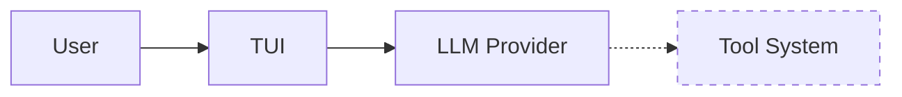

# Aircher Developer Quick Start

## Current Reality Check (August 2025)

**What Aircher IS**: A TUI chat client with excellent semantic search
**What Aircher ISN'T (yet)**: An AI coding assistant like Claude Code or Cursor

The agent/tool system exists but isn't connected. Users can chat with LLMs but LLMs can't execute any tools.

## File Structure

```
src/
├── ui/mod.rs           # TUI manager - needs agent integration HERE
├── agent/
│   ├── controller.rs   # Works but disconnected from TUI
│   └── tools/          # Complete tool implementations (unused)
├── providers/          # LLM providers (working)
└── intelligence/       # Semantic search (working)
```

## Development Priority

### 🚨 Phase 1: Connect the Dots (3-5 days)
```rust
// The problem in one line:
// TuiManager has no agent_controller field
```

**Required changes**:
1. Add `agent_controller` to `TuiManager` 
2. Parse LLM responses for `<tool_use>` blocks
3. Execute tools and show results
4. Handle approval flow

### Phase 2: Tool Loop (1 week)
- Multi-turn tool execution
- Proper context management
- Error handling

### Phase 3: Parity (1 week)  
- File operations
- Git integration
- Command execution

### Phase 4-6: Differentiation (4-6 weeks)
- Enhanced UI
- Turbo mode
- Task orchestration

## Quick Commands

```bash
# Run the TUI
cargo run --release

# What works:
/model   # Select provider
/search  # Semantic search
/auth    # Authentication

# What doesn't work:
"Read file X"     # Can't actually read
"Run command Y"   # Can't actually run
"Edit file Z"     # Can't actually edit
```

## Key Documents

1. **docs/architecture/roadmap.md** - Complete technical plan
2. **docs/CURRENT_STATE.md** - Detailed gap analysis  
3. **CLAUDE.md** - Agent instructions (keep updated)
4. **STATUS.md** - Project status

## The Big Picture



The dotted line is the problem. We need to make it solid.

## Getting Started

1. Read `docs/CURRENT_STATE.md` to understand the gap
2. Read `docs/architecture/roadmap.md` for the plan
3. Start with Phase 1: Connect AgentController to TuiManager
4. Test with simple tool calls like reading files

## Success Criteria

**Phase 1 is done when**:
```
User: "Read the README.md file"
Assistant: [Actually reads and displays the file contents]
```

Not:
```
User: "Read the README.md file"  
Assistant: "I'll help you read that file..." [can't actually do it]
```

## Remember

- The code quality is good
- The architecture is sound
- We just need to connect the pieces
- Each phase delivers immediate value

Start with Phase 1. Everything else depends on it.