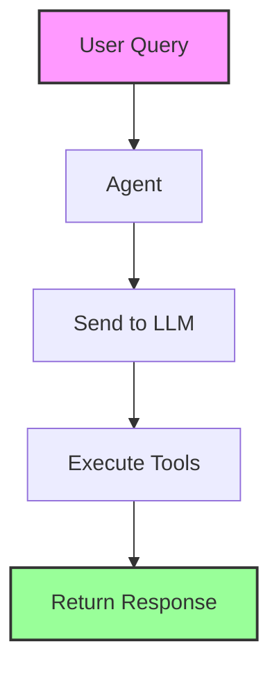
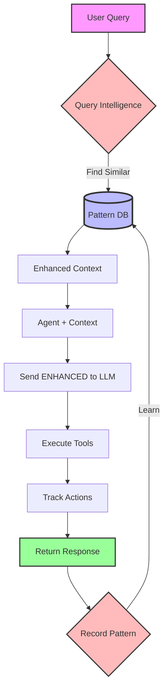

# Intelligence Workflow Diagram

## Current Workflow (WITHOUT Intelligence) ❌



**Problems**:
- No learning
- No context
- No improvement
- Every query starts fresh

## Intelligent Workflow (WITH Intelligence) ✅



## Step-by-Step Workflow

### 1️⃣ User Query Arrives
```
User: "Fix the compilation error in main.rs"
                    ↓
```

### 2️⃣ Intelligence Enhancement (BEFORE LLM)
```
Intelligence System:
  - Searches: Find patterns matching "compilation error" + "main.rs"
  - Finds: 3 similar past fixes
  - Extracts: "Usually caused by missing imports"
  - Predicts: "main.rs often changes with lib.rs"
                    ↓
```

### 3️⃣ Enhanced Context to LLM
```
LLM Receives:
  Original: "Fix the compilation error in main.rs"
  + Intelligence: "Similar errors fixed by checking imports (85% success)"
  + Prediction: "Consider checking lib.rs too"
                    ↓
```

### 4️⃣ LLM Makes INFORMED Decision
```
LLM Thinks: "Based on intelligence, I should check imports first"
Generates: Tool calls with higher confidence
                    ↓
```

### 5️⃣ Track Tool Execution
```
Tools Execute:
  1. read_file("main.rs") → Track: 15ms, success
  2. read_file("lib.rs") → Track: 10ms, success  
  3. edit_file("main.rs", add_import) → Track: 5ms, success
  4. run_command("cargo check") → Track: 2000ms, success
                    ↓
```

### 6️⃣ Record Pattern for Learning
```
Pattern Recorded:
  - Context: "compilation error in main.rs"
  - Actions: [read, read, edit, check]
  - Files: ["main.rs", "lib.rs"]
  - Success: true
  - Duration: 2030ms
                    ↓
```

### 7️⃣ Next Time Gets Smarter
```
Next Similar Query:
  - Intelligence: "Last time this worked: check imports in main.rs and lib.rs"
  - Confidence: 90% (was 85%, improved!)
  - Suggestion: "Skip checking other files, go straight to imports"
```

## The Learning Curve

```
Query 1: Trial and error → Find solution → 5 attempts
Query 2: Use past pattern → Find solution → 3 attempts  
Query 3: High confidence → Find solution → 2 attempts
Query 4: Direct solution → Find solution → 1 attempt
Query 5: Suggests optimizations beyond the question
```

## What Each Component Does

### Pattern Database
- Stores: What worked, what didn't
- Indexes: By context, files, tools, success
- Queries: Similarity search, trend analysis

### Intelligence Engine
- Analyzes: Current query vs past patterns
- Predicts: Likely actions needed
- Suggests: Best approach based on history
- Learns: Updates patterns with new outcomes

### Agent Controller
- Queries: Intelligence before acting
- Tracks: All actions taken
- Records: Outcomes for learning
- Improves: With every interaction

## Why This Workflow Makes Sense

### For Users
- **Faster solutions** - Agent knows what worked before
- **Fewer errors** - Avoids known failures
- **Better suggestions** - Predicts related changes
- **Continuous improvement** - Gets smarter over time

### For the Agent
- **Contextual awareness** - Understands project patterns
- **Confidence in actions** - Based on past success
- **Efficient execution** - Skips unnecessary steps
- **Learning capability** - Improves with experience

### For the Product
- **Competitive advantage** - Smarter than static agents
- **User retention** - Agent becomes more valuable over time
- **Reduced costs** - Fewer LLM calls needed as patterns learned
- **Unique value** - Personalized to each project

## The Bottom Line

```
Without Intelligence:
  User Query → Generic Response → Hope it works

With Intelligence:
  User Query → Past Learning → Informed Response → Record Result → Get Smarter
```

**This is the difference between a tool and an assistant.**